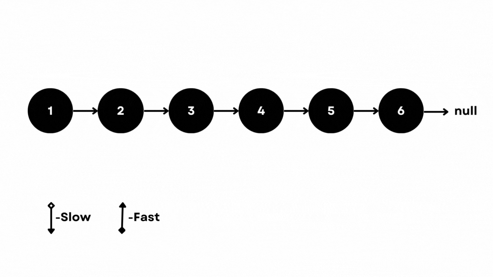
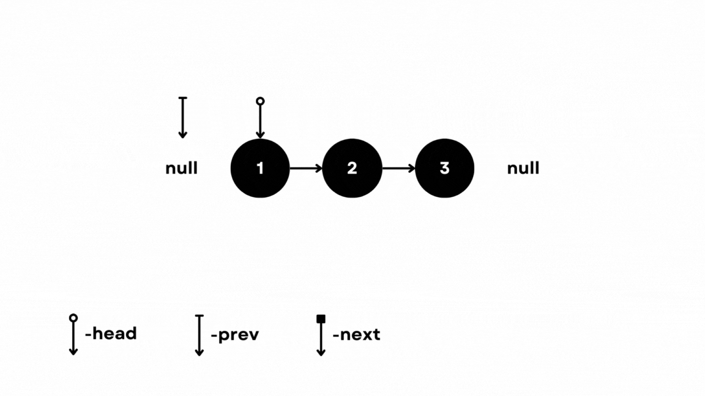

<div>


## Linked List
### Approaches:
* ** ** :  
E.g.:  
    *   

### Problems:
1. #### [Finding middle element in a Linked list](https://practice.geeksforgeeks.org/problems/finding-middle-element-in-a-Linked-list/1) :

**Question** :

Given a singly linked list of N nodes.
The task is to find the middle of the linked list. For example, if the linked list is
1-> 2->3->4->5, then the middle node of the list is 3.
If there are two middle nodes(in case, when N is even), print the second middle element.
For example, if the linked list given is 1->2->3->4->5->6, then the middle node of the list is 4.

**Intuition** :

This problem can be easily solved using fast and slow pointer method.

**Approach** :

Using a **fast pointer and slow pointer both initialised at head**.  
Iterate while **fast.next and fast.next.next are not null** by updating **fast as fast.next.next** and **slow as slow.next**.  
If after coming out of loop, **fast.next != null and fast.next.next is null**, that means length of list is even and as defined in the question return second middle element, so return slow.next.
Else return slow.



**Complexity** :  

- Time complexity: $O(n)$  

- Space complexity: $O(1)$ 

```java
class Solution
{
    int getMiddle(Node head)
    {
        Node fast=head,slow=head;
        while(fast.next!=null && fast.next.next!=null){
            fast=fast.next.next;
            slow=slow.next;
        }
        if(fast.next!=null) return slow.next.data;
        return slow.data;
    }
}
```  
---  

2. #### [Reverse a linked list](https://practice.geeksforgeeks.org/problems/reverse-a-Linked-list/1) :

**Question** :

Given a linked list of N nodes. The task is to reverse this list.

**Intuition** :

Moving from head to tail of list, keep reversing the links and at the end return tail.

**Approach** :

Take two nodes **prev and next**.  
While head is not null, set next as head.next, head.next as prev, prev as head and head as next.  
Return prev.



**Complexity** :  

- Time complexity: $O(n)$  

- Space complexity: $O(1)$ 

```java
class Solution
{
    //Function to reverse a linked list.
    Node reverseList(Node head)
    {
        Node prev=null,p=null;
        while(head!=null){
            p=head.next;
            head.next=prev;
            prev=head;
            head=p;
        }
        return prev;
    }
}
```  
--- 

3. #### [Rotate a Linked List](https://practice.geeksforgeeks.org/problems/rotate-a-Linked-list/1) :

**Question** :

Given a singly linked list of size N. The task is to left-shift the linked list by k nodes, where k is a given positive integer smaller than or equal to length of the linked list.

**Intuition** :

Iterate till k, remove the link at that point and add it at the end.

**Approach** :

We have to manage **edge cases like if k=0 or k=n**. We return head in both cases since not rotating a list and rotating the whole list yeilds the list itself.  
Else, **we travel till k nodes**, **remove the link**, then **travel till end and add the k nodes**.

**Complexity** :  

- Time complexity: $O(n)$  

- Space complexity: $O(1)$ 

```java
class Solution{
    //Function to rotate a linked list.
    public Node rotate(Node head, int k) {
        if(k==0) return head;
        Node i=head,h=null;
        int c=0;
        while(++c<k) {i=i.next;}
        if(i.next==null) return head;
        h=i.next;
        i.next=null;
        i=h;
        while(h.next!=null) h=h.next;
        h.next=head;
        return i;
    }
}
```  
---  

4. #### [Intersection point in Y shaped Linked lists](https://practice.geeksforgeeks.org/problems/intersection-point-in-y-shapped-linked-lists/1) :

**Question** :

There are two singly linked lists in a system. By some programming error, the end node of one of the linked lists got linked to the second list, forming an inverted Y-shaped list. Write a program to get the point where two linked lists merge. 

**Intuition** :

I did not really have any definite ideas for this question and this is a question that I had not encounted before.

**Approach** :

Start iterating from each head. If they meet before reaching the end return the intersection point.
Else, **for the pointer that has reached the end of the list start interating again from the other head**.
Before the end of this iteration, they will meet. Return this node.
Else return -1.

**Complexity** :  

- Time complexity: $O(n+m)$  

- Space complexity: $O(1)$ 

```java
class Intersect
{
    //Function to find intersection point in Y shaped Linked Lists.
	int intersectPoint(Node head1, Node head2)
	{
         Node p=head1,q=head2;
         boolean flag1=true, flag2=true;
         
         while(p!=null && q!=null){
             if(p==q)return p.data;
             if(p.next==null && flag1){
                 flag1=false;
                 p=head2;
             }
             else p=p.next;
             if(q.next==null && flag2){
                 flag2=false;
                 q=head1;
             }
             else q=q.next;
         }
         return -1;
	}
}
```  
--- 

5. #### [Detect Loop in Linked list](https://practice.geeksforgeeks.org/problems/detect-loop-in-linked-list/1) :

**Question** :

Given a linked list, check if the linked list has a loop or not. 

**Intuition** :

This question was really simple and a common usecase of **slow and fast pointers**.

**Approach** :

Take a slow pointer and a fast pointer and start interating till fast pointer reaches the end of the list or meets slow pointer again.
If we reach the end of the list return false, else if fast==slow return true.

**Complexity** :  

- Time complexity: $O(n)$  

- Space complexity: $O(1)$ 

```java
class Solution {
    //Function to check if the linked list has a loop.
    public static boolean detectLoop(Node head){
        Node slow=head,fast=head;
        while(fast.next!=null && fast.next.next!=null){
            slow=slow.next;
            fast=fast.next.next;
            if(slow==fast) return true;
        }
        return false;
    }
}
```  
--- 

6. #### [Remove loop in Linked List](https://practice.geeksforgeeks.org/problems/remove-loop-in-linked-list/1) :

**Question** :

Write a function detectAndRemoveLoop() that checks whether a given Linked List contains a loop and if the loop is present then remove the loop and return true. If the list doesn’t contain a loop then it returns false. 

**Intuition** :

The fast and the slow pointer will meet at a node which is included in the loop that is present. 
**Check if loop is present** in the list and if so, **interate slow and fast pointer till they meet**.
When they meet **take the slow pointer to the head and leave fast at the meeting point** and **start moving both the pointers at same speed till they are about to meet. Remove the loop at that point**.
There is also a case where, **the node they meet at is the head of the list** and therefore after moving the slow pointer to head we have to **check if slow==fast** and if so we move the **loop till fast.next is slow and then remove loop**.

**Approach** :


**Complexity** :  

- Time complexity: $O(n)$  

- Space complexity: $O(1)$ 

```java
class Solution
{
    //Function to remove a loop in the linked list.
    public static void removeLoop(Node head){
        Node p=head, q=head;
        while(q.next!=null && q.next.next!=null){
            p=p.next;
            q=q.next.next;
            if(p==q) break;
        }
        if(q.next==null || q.next.next==null) return;
        p=head;
        if(p==q){
            while(q.next!=p) q=q.next;
        }
        else{
            while(p.next!=q.next){
                p=p.next;
                q=q.next;
            }
        }
        q.next=null;
    }
}
```  
---

7. #### [n’th node from end of Linked list](https://practice.geeksforgeeks.org/problems/nth-node-from-end-of-linked-list/1) :

**Question** :

Given a Linked List and a number N, write a function that returns the value at the Nth node from the end of the Linked List.

**Intuition** :

This question was simple, we have to iterate to find length of the list and then iterate again to n-k th node from beginning.

**Approach** :

Count the number of nodes by iterating the list. The iterate to the c-n th node.

**Complexity** :  

- Time complexity: $O(n)$  

- Space complexity: $O(1)$ 

```java
class GfG
{
    //Function to find the data of nth node from the end of a linked list.
    int getNthFromLast(Node head, int n)
    {
    	Node i=head;
    	int c=0;
    	while(head!=null){
    	    c++;
    	    head=head.next;
    	}
    	if(n>c)return -1;
    	else c=c-n;
    	
    	while(c-->0){
    	    i=i.next;
    	}
    	return i.data;
    }
}
```  
---  

8. #### [Merge two sorted Linked lists](https://practice.geeksforgeeks.org/problems/merge-two-sorted-linked-lists/1) :

**Question** :

AuxiliaryGiven two sorted linked lists consisting of N and M nodes respectively. The task is to merge both of the lists (in place) and return the head of the merged list.

**Intuition** :

This question is similar to merging two sorted arrays using merge function of mergesort.

**Approach** :

While iterating both lists, check which node's value is smaller and then add that node to the already sorted bunch and keep iterating.
If one of the lists ends, merge the rest of other list to the merged list.

**Complexity** :  

- Time complexity: $O(n+m)$  

- Space complexity: $O(1)$ 

```java
class LinkedList
{
    //Function to merge two sorted linked list.
    Node sortedMerge(Node p, Node q) {
        Node soln=new Node(0);
        Node head=soln;
        while(p!=null && q!=null){
            if(p.data<q.data){
                head.next=p;
                p=p.next;
            }
            else{
                head.next=q;
                q=q.next;
            }
            head=head.next;
        }
        if(p!=null) head.next=p;
        if(q!=null) head.next=q;

        return soln.next;
   } 
}
```  
---  

9. #### [Check if Linked List is Palindrome](https://practice.geeksforgeeks.org/problems/check-if-linked-list-is-pallindrome/1) :

**Question** :

Given a singly linked list of characters, write a function that returns true if the given list is a palindrome, else false.

**Intuition** :

Reverse the list till half and then check if characters in both lists are same or not while moving in opposite direction.

**Approach** :

Keep reversing the list till you reach the middle of the list and then from the middle travel in both halves in opposite direction.
If at any point the characters do not match return false. Else reutrn true.

**Complexity** :  

- Time complexity: $O(n)$  

- Space complexity: $O(1)$ 

```java
class Solution
{
    //Function to check whether the list is palindrome.
    boolean isPalindrome(Node head) 
    {
        if(head==null || head.next==null)return true;
        Node k=head,prev=null;
        int c=0;
        while(k!=null){
            k=k.next;
            c++;
        }
        for(int i=0;i<c/2;i++){
            k=head.next;
            head.next=prev;
            prev=head;
            head=k;
        }
        if(c%2!=0) head=head.next;
        while(prev!=null && head!=null){
            if(prev.data!=head.data) return false;
            prev=prev.next;
            head=head.next;
        }
        return true;
    }    
}
```  
--- 

10. #### [Delete without head pointer](https://practice.geeksforgeeks.org/problems/delete-without-head-pointer/1) :

**Question** :

You are given a singly linked list and pointer which is pointing to the node which is required to be deleted. Any information about the head pointer or any other node is not given. You need to write a function to delete that node from the linked list. Your function will take only one argument, i.e., a pointer to the node which is to be deleted.

**Intuition** :

What I did was make equalize the next node to the current node, but thats not how references and links in linked list work. There was a clever solution.

**Approach** :

Take the node to be deleted and copy the data of its next node to it. Then just delete the next node by rewiring the list.

**Complexity** :  

- Time complexity: $O(1)$  

- Space complexity: $O(1)$ 

```java
class Solution
{
    void deleteNode(Node del)
    {
         del.data=del.next.data;
         del.next=del.next.next;
    }
}
```  
--- 

11. #### [Given a Linked list of 0s, 1s and 2s, sort it](https://practice.geeksforgeeks.org/problems/given-a-Linked-list-of-0s-1s-and-2s-sort-it/1) :

**Question** :

Given a linked list of 0s, 1s and 2s, The task is to sort and print it.

**Intuition** :

This was similar to sorting 0s,1s and 2s in an array.

**Approach** :

Count the number of 0s,1s and 2s and then overwrite the node data in sorted order.

**Complexity** :  

- Time complexity: $O(n)$  

- Space complexity: $O(1)$ 

```java
class Solution
{
    //Function to sort a linked list of 0s, 1s and 2s.
    
    static Node segregate(Node head)
    {
        int c0=0,c1=0,c2=0;
        Node p=head;
        while(p!=null){
            if(p.data==0)c0++;
            else if(p.data==1)c1++;
            else c2++;
            p=p.next;
        }
        p=head;
        while(p!=null){
            while(c0!=0){p.data=0;c0--;p=p.next;}
            while(c1!=0){p.data=1;c1--;p=p.next;}
            while(c2!=0){p.data=2;c2--;p=p.next;}
        }
        return head;
    }
}
```  
--- 

12. #### [Add two numbers represented by Linked lists](https://practice.geeksforgeeks.org/problems/add-two-numbers-represented-by-linked-lists/1) :

**Question** :

Given two numbers represented by two lists, write a function that returns the sum in the form of a linked list.

**Intuition** :

The way to solve this question was to perform adding like we normally would in pen and paper with the added benefit that we can add number greatly larger than any numeric data type(>2000 digits).

**Approach** :

Reverse both linked lists and keep adding nodes till the smaller list finishes while keeping track of the carry. Keep evaluating node till there is a carry.

**Complexity** :  

- Time complexity: $O(n+m)$  

- Space complexity: $O(max(n,m))$ 

```java
class Solution{
    static Node addTwoLists(Node first, Node second){
        int carry=0;
        first=reverse(first);second=reverse(second);
        int length1=length(first),length2=length(second);
        Node temp=first;
        if(length2>length1) {first=second;second=temp;}
        temp=first;
        while(first!=null){
            first.data=first.data+carry+(second!=null?second.data:0);
            carry=first.data/10;
            first.data%=10;
            if(first.next==null && carry!=0) {first.next=new Node(carry); break;}
            first=first.next;
            if(second!=null)second=second.next;
        }
        first=reverse(temp);
        return first;
    }
    static Node reverse(Node head){
        Node temp=null,prev=null;
        while(head!=null){
            temp=head.next;
            head.next=prev;
            prev=head;
            head=temp;
        }
        return prev;
    }
    static int length(Node head){
        int c=0;
        for(;head!=null;head=head.next)c++;
        return c;
    }
}
```  
---  

13. #### [Implement Queue using Linked List](https://www.geeksforgeeks.org/problems/implement-queue-using-linked-list/1) :

**Question** :

Implement a Queue using Linked List. 
A Query Q is of 2 Types
(i) 1 x   (a query of this type means  pushing 'x' into the queue)
(ii) 2     (a query of this type means to pop an element from the queue and print the poped element)

**Intuition** :

Basic question of using a linked list like a queue by simulation pop and push by managing front and rear nodes.

**Approach** :

If there are no elements in the queue and you add an element make a new node and assign the data to it. Assign both front and rear to this node.
Else just keep adding to the end of the existing nodes using front.
If there are no elements and we try to pop, return -1.
Else just iterate to the next node of rear and return the data of previous node.
If rear and front meet and we have to pop, return current data and set both to null.

**Complexity** :  

- Time complexity: $O(1)$  

- Space complexity: $O(1)$ 

```java
class MyQueue
{
    QueueNode front;
    QueueNode rear;
    
    //Function to push an element into the queue.
	void push(int a)
	{
        QueueNode x=new QueueNode(a);
        if(this.front==null) {
            this.front=x;
            this.rear=x;
        }
        else{
            this.front.next=x;
            this.front=this.front.next;
        }
	}
	
    //Function to pop front element from the queue.
	int pop()
	{
        if(this.rear==null) return -1;
        int x=this.rear.data;
        if(this.rear==this.front) front=null;
        this.rear=this.rear.next;
        return x;
	}
}
```  
---  

14. #### [Implement Stack using Linked List](https://practice.geeksforgeeks.org/problems/implement-stack-using-Linked-list/1) :

**Question** :

You have a linked list and you have to implement the functionalities push and pop of stack using this given linked list. Your task is to use the class as shown in the comments in the code editor and complete the functions push() and pop() to implement a stack.

**Intuition** :

Basic question of using a linked list like a stack by simulation pop and push by managing top node.

**Approach** :

If we push to any empty list create a node and assign it top.
Else create a new node and add it to the beginning to the list.

If we pop an empty list return -1.
Else iterate to the next node. And return the data of previous node.

**Complexity** :  

- Time complexity: $O(1)$  

- Space complexity: $O(1)$ 

```java
class MyStack 
{
    // class StackNode {
    //     int data;
    //     StackNode next;
    //     StackNode(int a) {
    //         data = a;
    //         next = null;
    //     }
    // }   
    StackNode top;
    
    //Function to push an integer into the stack.
    void push(int a) 
    {
        StackNode x=new StackNode(a);
        x.next=top;
        top=x;
    }
    
    //Function to remove an item from top of the stack.
    int pop() 
    {
        if(top==null)return -1;
        int x=top.data;
        top=top.next;
        return x;
    }
}
```  
---  
</div>
